## 数据处理
首先利用𝑆𝑐𝑖𝑝𝑦库对.𝑎𝑟𝑓𝑓文件进行读取，读取到的数据大小为$70000×785$。其中最后一列为标签，数据类型为𝑏𝑦𝑡𝑒𝑠，将其转换成int类型后进行分割，并封装成数据集类。

```python
data, _ = arff.loadarff("mnist_784.arff")
data = pd.DataFrame(data).to_numpy()
temp = []
for i in range(len(data)):
    temp.append(int(data[i, -1]))
data = np.hstack([data[:, :-1], np.array(temp).reshape(-1, 1)])
data = pd.DataFrame(data)
data = dataset(data.iloc[:, :])
```

观察原始数据，我们可以发现特征向量中存在着大量的0，代表数字图像的背景，这对于我们的分类工作而言没有帮助，而且维度过高会影响分类器的速度，因此使用主成分分析法（PCA）对原始数据进行降维（借助sklearn实现）。方差和占比描述了降维后特征保留的信息量，保留不同数量的特征，其方差和占比关系图如下所示。

<!--  -->

<center>
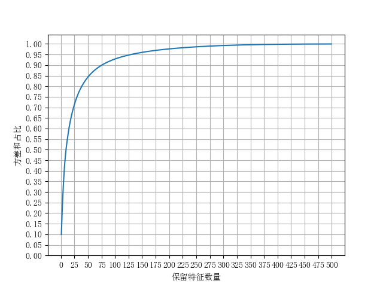
</center>

由上图可知，当保留数量为350时，方差和占比大于99%,绝大部分信息没有丢失，因此选择保留特征数量350并使用PCA对其进行降维。

## 小规模数据测试

### **KNN算法测试**
设置超参数K=5，选取前2000条数据作为训练数据，并选择第2001到3000条数据作为测试数据。

经初步测试，在训练数据上，KNN的分类准确率可达91.5%。效果较为理想。

同时数据集的大小也会左右分类器的正确率，但是同时也影响了程序运行的时间，因此选择不同的初始数据量，并统一选择测试数据量为5000，记录分类准确率和程序运行时间，如下图所示。

<figure class="half">
<center>
    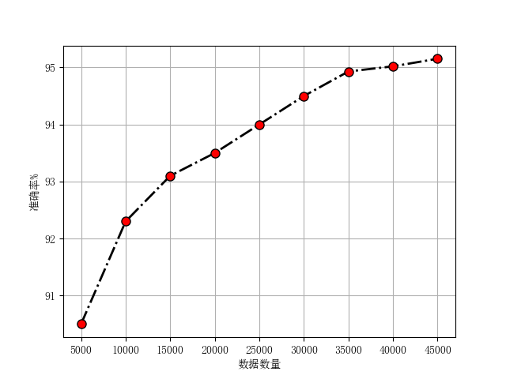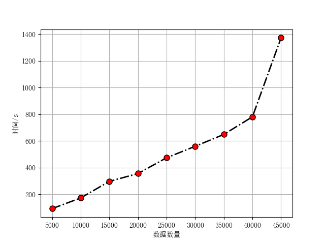
</center>
</figure>

从图中可知，初始数据集数量越大，分类正确率越高，但同时程序运行的时间也相应增加，但对于本问题而言，训练所有数据所用时间仍可接受，故未来选择此方法进行进一步的训练与测试。

### **SVM算法测试**
采用OVR分类策略，选择前1000条数据进行训练与分析，惩罚项C=5，高斯核函数的方差σ=0.5，选择不同的迭代次数，其正确率变化情况如下。

<center>

</center>

由图可知，迭代次数越多，其分类正确率就越高，这是因为SMO算法每迭代一次都会更新两个参数的值，迭代次数过少的话会导致部分参数得不到更新，因此正确率偏低。

然而，当数据量较大时，SVM分类器训练所需要的时间也大幅增加，在测试过程中，针对1000条数据进行训练，全部迭代300次所需时间超过6000s，针对此问题而言，样本数量过少容易出现过拟合问题，而增加样本数量会导致运行时间进一步增加至不可接受。另外，SVM多用于二分类问题，对于本问题的多分类情况，采用OVR策略进行分类并训练10个SVM分类器进行分类，然而这样做的缺点是在针对某一类样本的训练过程中，其余9类均被分类为负类，从而导致数据量相差悬殊，分类器会倾向于将样本分为负类，从而造成分类准确率下降。因此在本文未来的分类中，不选择SVM分类器作为分类方法。

### **MLP算法测试**

针对本问题，首先将数据集标签转换成对应的onehot向量，并选择训练数据为前2000条，测试数据为2001到3000条。选择MLP的隐藏层数量为1，隐藏层神经元的数量为48，学习率为0.001，批尺寸为100，迭代次数为3000，其loss下降曲线如下图所示。

<center>
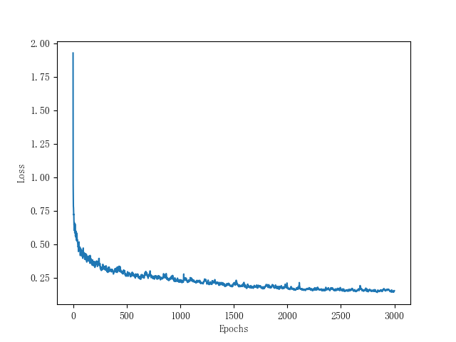
</center>

可见在迭代3000次时，MLP的loss已收敛，此时分类正确率为89.64%，分类效果较好，且运行时间较短，因此将采用MLP进行进一步对比研究。


## 五折交叉验证与测试
### **KNN分类结果与分析**
在上面的分类中，根据经验选择了K=5，取得了较高的分类准确率和泛化能力，但是K的取值在一定程度上会影响分类准确程度，当K取值为[1,6]时，分别记录5个分类器在测试集以及验证集上的表现，如下图所示。

<figure class="half">
<center>
    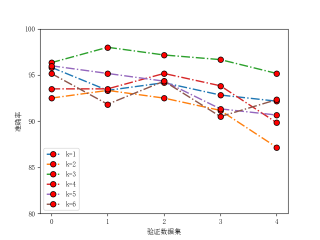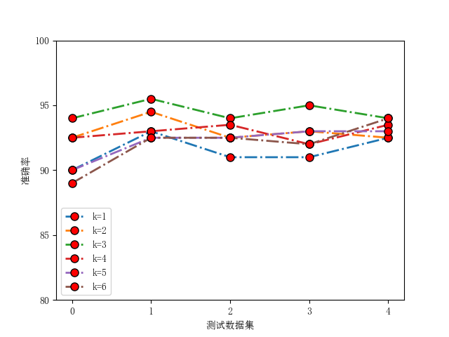
</center>
</figure>
根据图中对比，可知当K=3时效果最优，在验证集上的平均准确率为96.92%，在测试集上准确率达到了96.08%。故对于本问题，调整原始方案中的参数K为3可以获得更高的准确率。

### **MLP分类结果与分析**
本文中所采用的多层感知器结构如下图所示，隐藏层的激活函数选择为Sigmoid函数，损失函数选择交叉熵函数。
<center>
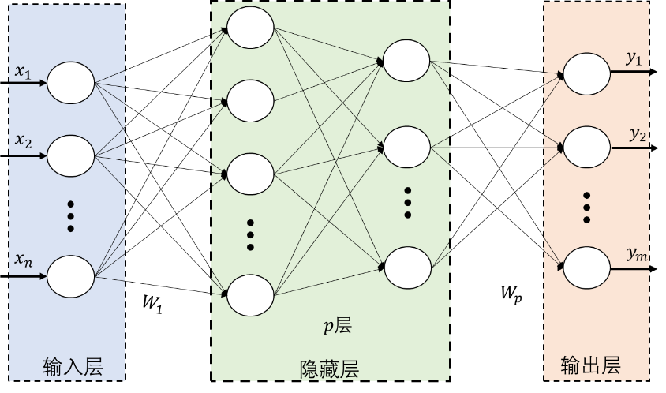
</center>

使用5折交叉验证法对多层感知器进行训练，此时MLP的隐藏层数量为1，隐藏层神经元的数量为48，学习率为0.001，批尺寸为100，迭代次数为3000次，同时引入学习率衰减机制。五个分类器训练过程中的loss下降曲线如下图所示。
<center>
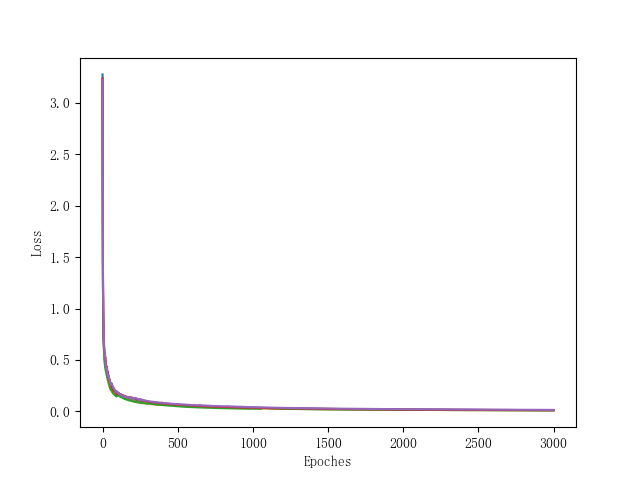
</center>

由上图可见，5个分类器均能够在迭代2000~3000次时收敛。接着对比5个MLP分类器在验证集以及测试集上的正确率，如下图所示。

<figure class="half">
<center>
    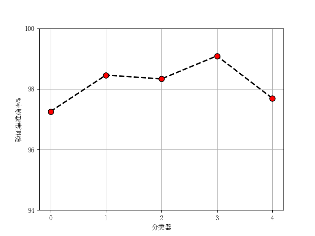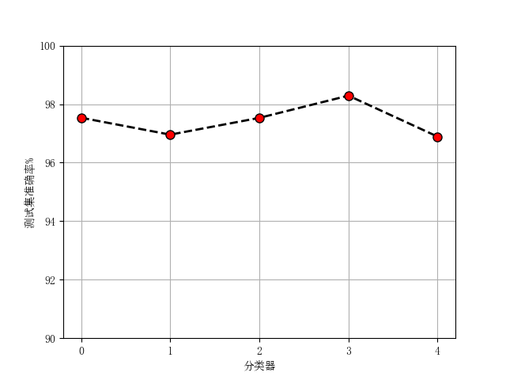
</center>
</figure>

5个MLP分类器在验证集上的平均准确率为98.09%，在测试集上的平均准确率为97.86%。然后增加隐藏层神经元的数量至64，保持其他参数不变，此时5个MLP分类器在测试集以及验证集上的正确率如下图所示。

<figure class="half">
<center>
    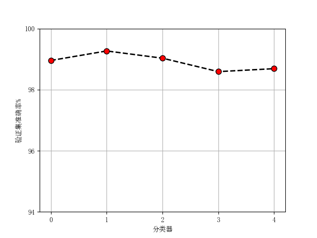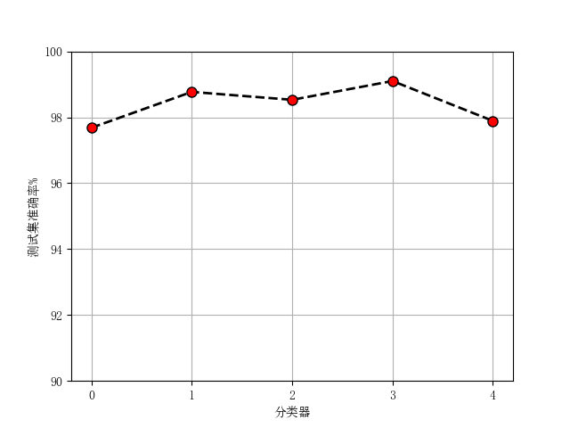
</center>
</figure>

由上图可知，在增加隐藏层神经元数量后分类器的表现得到了增强。此时5个分类器在验证集上的平均准确率为98.93%，在测试集上的平均准确率为97.92%。

接下来增加隐藏层层数至2层，此时隐藏层神经元的数量为(48,16)，保持其他参数不变，这时5个分类器在测试集以及验证集上的正确率如下图所示。

<figure class="half">
<center>
    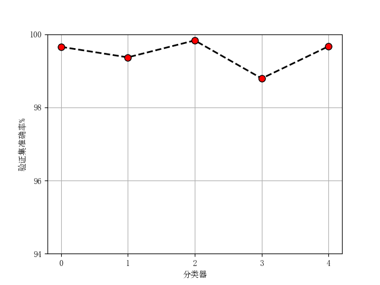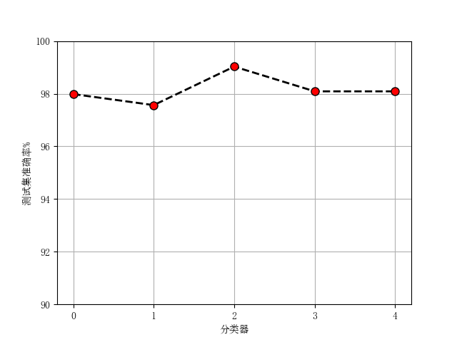
</center>
</figure>

此时5个分类器在验证集上的平均准确率为99.02%，在测试集上的平均准确率为98.02%。在增加隐藏层的数量后，分类器在验证数据集上的准确率和在测试数据集上的表现虽然有一定的提升，但与神经元数量为64时相比提升不大，这可能是由于网络层数增加，产生了一定程度的过拟合而引起的。

## 基于HOG特征的手写数字识别
### **KNN分类结果**
选择KNN参数K=3，利用提取的HOG特征向量进行五折交叉验证，验证集和测试集上的结果分别如下图所示。此时5个分类器在验证集上的平均准确率为97.68%，在测试集上的平均准确率为96.26%。
<figure class="half">
<center>
    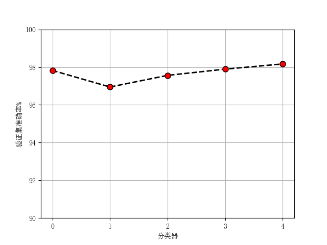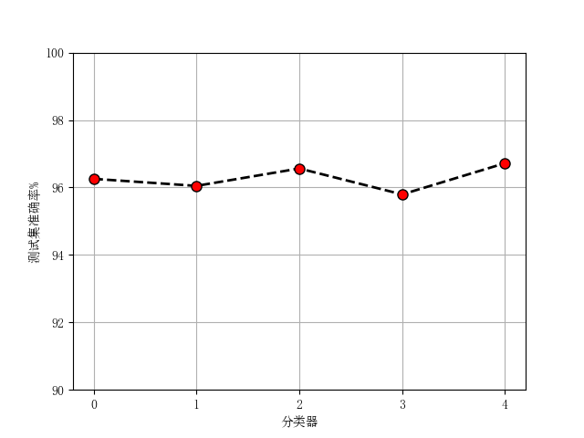
</center>
</figure>

### **MLP分类结果**
选择神经网络层数为1，神经元数量为64，利用提取到的HOG特征向量进行五折交叉验证，验证集和测试集上的结果分别如下图所示。此时5个分类器在验证集上的平均准确率为99.14%，在测试集上的平均准确率为98.18%。
<figure class="half">
<center>
    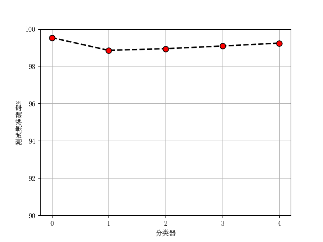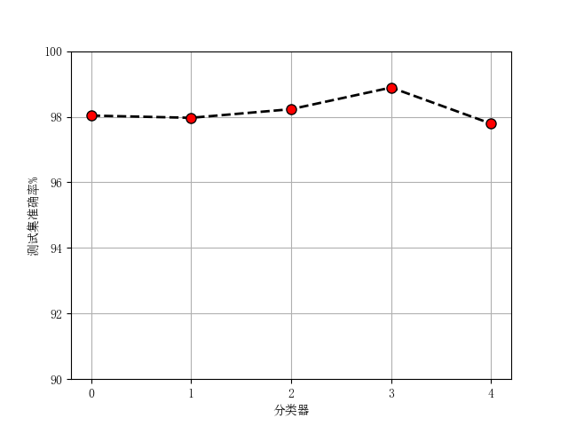
</center>
</figure>

## 总结与分析

KNN分类器的实现方式十分简单，且无训练过程，然而KNN的准确率与K的取值以及初始数据量的数量密切相关。根据上述结果，总结出以下结论。
- KNN分类器的准确率十分依赖数据，初始数据量越大，KNN分类器的分类准确率越高；
- K的值过大时，分类器的分类准确率较低，针对本题目而言，在K=3时，分类效果最好；

相比于KNN而言，MLP原理更为复杂，但是整体正确率较高。根据上述结果，总结出以下结论。
- 在隐藏层层数相同时，隐藏层神经元的数量越多，分类准确率越高，泛化误差越低；
- 在其他参数相同时，增加MLP隐藏层的层数，分类准确率会得到提升，但在层数过高时有可能会出现一定程度的过拟合现象。

另外，高级特征的提取有助于更好地描绘图像的特性，使用HOG特征向量进行分类后无论是KNN方法还是MLP分类器，其分类准确率均有不同程度的提高。